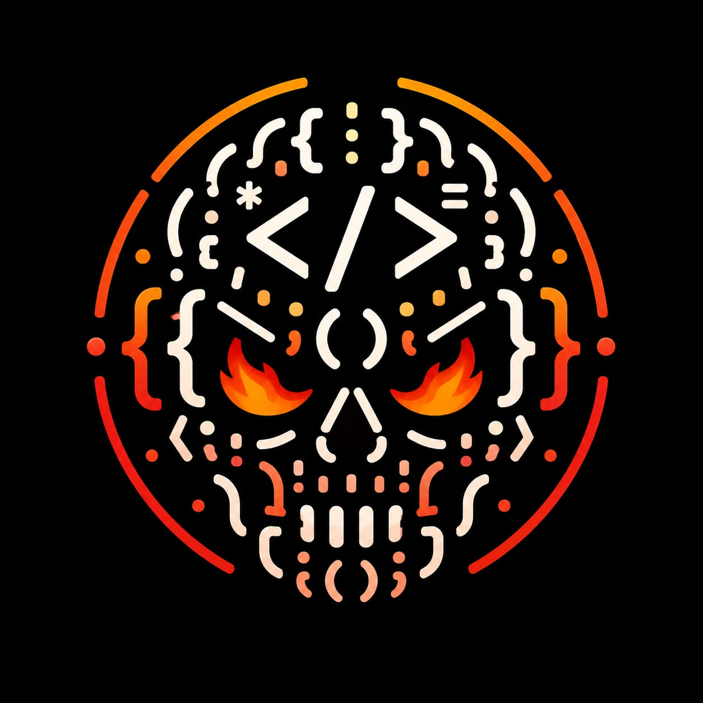

<div align="center">



# ROASTMYCODE

**AI-powered code judgment for developers who prefer memorable feedback.**

[](https://github.com/vincenzo-afk/roastmycode)
[](https://github.com/vincenzo-afk/roastmycode/commits/main)
[](https://github.com/vincenzo-afk/roastmycode)
[](https://github.com/vincenzo-afk/roastmycode)
[](https://github.com/vincenzo-afk/roastmycode)
[](https://github.com/vincenzo-afk/roastmycode/stargazers)
[](https://vercel.com/)

[Live site](https://roastmycode-lemon.vercel.app/) · [Documentation](#documentation) · [Report a bug](https://github.com/vincenzo-afk/roastmycode/issues/new) · [Request a feature](https://github.com/vincenzo-afk/roastmycode/issues/new)

</div>

## Table of Contents

- [About the Project](#about-the-project)
- [Features](#features)
- [Tech Stack](#tech-stack)
- [Getting Started](#getting-started)
- [Usage](#usage)
- [API Reference](#api-reference)
- [Project Structure](#project-structure)
- [Roadmap and Limitations](#roadmap-and-limitations)
- [Testing](#testing)
- [Deployment](#deployment)
- [Contributing](#contributing)
- [Security](#security)
- [License](#license)
- [Acknowledgments](#acknowledgments)

---

## About the Project

ROASTMYCODE is a browser-based code roasting and refactoring tool. A developer pastes a code sample, chooses a roast personality and language, and receives a streaming technical verdict with pain scores, developer-personality observations, a code-alignment label, a worst-crime diagnosis, and a dramatic final verdict.

The project is intentionally more theatrical than a conventional linter. Its purpose is to make code feedback specific, memorable, and easy to share while still pointing at real patterns in the submitted code. The application also includes an emergency refactor flow that returns a cleaned-up version of the same code together with a damage assessment.

### What problem does it solve?

Traditional static analysis is useful but often emotionally flat and difficult to share. ROASTMYCODE adds a human-readable narrative layer on top of an AI review so developers can quickly understand why a code sample is risky, confusing, or unusually chaotic. It is a playful companion to—not a replacement for—tests, linters, security scanners, and human review.

### Key Features

- **Multiple roast personalities:** Choose from distinct reviewer profiles such as Funny, Strict Professor, Hacker, and other built-in modes.
- **Streaming roast output:** The main roast endpoint proxies a server-sent event stream from Groq so the verdict can appear progressively.
- **Pain-score dossier:** Review maintainability, readability, chaos, bug probability, spaghetti level, production-crash probability, and related signals.
- **Emergency refactor:** Ask the AI for a cleaner version of the submitted code and a before/after damage assessment.
- **Language-aware editor:** Work with JavaScript, TypeScript, Python, Ruby, Rust, Java, C, C++, Go, or automatic detection.
- **Cursed samples:** Load built-in code examples when you want to test the experience quickly.
- **Hall of Shame:** Keep a local leaderboard of the most chaotic roasts in the current browser.
- **Shareable roast cards:** Render a result as an image with `html2canvas` for sharing.
- **Optional read-aloud mode:** Use the browser's native `SpeechSynthesis` API to hear the roast.
- **Theme switcher:** Toggle between dark and light presentation modes.
- **Repository access:** Open the source repository directly from the application header, editor actions, and footer.

### Screenshots and Diagrams

The primary brand mark is included in the repository at [`assets/roastmycode-logo.png`](assets/roastmycode-logo.png). The live interface is available at [roastmycode-lemon.vercel.app](https://roastmycode-lemon.vercel.app/).

The main request flow is:

```text
Browser editor
    │
    ├── POST /api/roast ───────► Vercel Function ───────► Groq Chat Completions
    │                                  │                         │
    │                                  └──── streamed SSE ◄──────┘
    │
    └── POST /api/refactor ───► Vercel Function ───────► Groq Chat Completions
                                       │
                                       └──── JSON response ◄─────┘
```

## Tech Stack

| Area | Technology | Role |
| --- | --- | --- |
| Frontend | Semantic HTML, vanilla JavaScript, Tailwind CSS CDN | Single-page interface and responsive layout |
| Editor | Native `<textarea>` plus custom line numbers | Code entry, tab indentation, language selection, and character count |
| Highlighting | Prism.js 1.29.0 | Syntax-highlighting support for submitted code and refactor output |
| Icons | Lucide ESM bundle | Interface iconography |
| Image export | html2canvas 1.4.1 | Client-side roast-card rendering |
| Voice | Browser SpeechSynthesis API | Optional read-aloud experience |
| Backend | Vercel Serverless Functions | Secure proxy layer for AI requests |
| AI provider | Groq Chat Completions API | Roast and refactor generation using `llama-3.3-70b-versatile` |
| Hosting configuration | `vercel.json` | Root rewrite and serverless function duration |
| Data storage | Browser `localStorage` | Local Hall of Shame entries; no application database is configured |

## Getting Started

### Prerequisites

For the frontend shell, you need a modern browser with JavaScript enabled and a local static server. For live AI functionality, you also need a Vercel project and a Groq API key.

| Requirement | Minimum / expectation |
| --- | --- |
| Git | Any recent version |
| Browser | Current Chrome, Firefox, Safari, or Edge |
| Node.js | Needed by the Vercel CLI; use a current LTS release |
| Vercel account | Required to deploy the serverless functions |
| Groq account | Required to create `GROQ_API_KEY` |

### Installation

```bash
git clone https://github.com/vincenzo-afk/roastmycode.git
cd roastmycode
```

The repository does not currently include a `package.json` or build step. To preview only the static interface, run a local server from the repository root:

```bash
python3 -m http.server 8080
```

Then open [http://localhost:8080/roastmycode.html](http://localhost:8080/roastmycode.html). The page will load, but `/api/roast` and `/api/refactor` require a serverless runtime and will not work through a plain static server.

### Configuration

Copy the example environment file when deploying with Vercel:

```bash
cp .env.example .env
```

Set the following value in the Vercel project settings or local Vercel environment:

| Variable | Required | Description |
| --- | --- | --- |
| `GROQ_API_KEY` | Yes for AI features | Secret key used by the serverless functions to call Groq. Never expose it in browser code. |

The client sends `code`, `mode`, and `language` to `/api/roast`, and `code` plus `language` to `/api/refactor`. No database connection, user account, or additional feature flag is currently configured.

## Usage

### Roast a code sample

1. Open the website.
2. Choose a roast personality.
3. Select a language or leave detection on automatic.
4. Paste code into the editor, or select **SURPRISE** to load a built-in sample.
5. Select **INITIATE ROAST**.
6. Review the streaming roast, pain meter, metrics, verdict, and Hall of Shame controls.

### Refactor a code sample

Select **REFACTOR** after entering code. The response includes a short roast, a refactored code block, a damage assessment, and a list of fixes. The refactor flow keeps the requested language where possible.

### Share a roast card

After a roast completes, use the share/download controls in the results panel. The image is generated in the browser from the hidden roast-card template; no server-side image storage is used.

### Documentation

This README is the project documentation. API behavior is documented in the [API Reference](#api-reference), while the interface source is contained in [`roastmycode.html`](roastmycode.html).

## API Reference

### `POST /api/roast`

Proxies a streaming chat completion request to Groq and returns the upstream server-sent event stream.

#### Request body

```json
{
  "code": "function add(a, b) { return a + b; }",
  "mode": "funny",
  "language": "javascript"
}
```

`code` is required. `mode` selects a built-in system prompt and defaults to the Funny profile when unknown. `language` is optional and defaults to `auto` in the handler.

#### Response

Successful responses use `Content-Type: text/event-stream` and proxy Groq's streaming chunks. The browser assembles the content and parses the final JSON roast payload.

#### Errors

| Status | Meaning |
| --- | --- |
| `400` | No code was provided |
| `401` / provider status | Groq rejected the configured credentials or request |
| `405` | Request method was not `POST` |
| `429` | Groq rate limit was reached |
| `500` | Missing `GROQ_API_KEY` or an internal proxy failure |

### `POST /api/refactor`

Requests a non-streaming refactor response from Groq.

#### Request body

```json
{
  "code": "const items = data.map(x => x.value)",
  "language": "javascript"
}
```

#### Response

```json
{
  "content": "ROAST: ...\n\nREFACTORED:\n```javascript\n..."
}
```

The endpoint returns `400`, `405`, provider error statuses, or `500` using the same general error conventions as `/api/roast`.

## Project Structure

```text
roastmycode/
├── api/
│   ├── refactor.js          # Vercel function for emergency refactors
│   └── roast.js             # Vercel function for streamed roast responses
├── assets/
│   └── roastmycode-logo.png # Supplied brand emblem used by the app and README
├── .env.example             # Environment variable template
├── .gitignore               # Local secrets and generated files excluded from Git
├── ideas.md                 # Chosen visual direction and brand system
├── roastmycode.html         # Complete frontend application
├── robots.txt               # Crawler policy and sitemap reference
├── sitemap.xml              # Canonical public URL for search engines
├── site.webmanifest         # Installable metadata and app icon
└── vercel.json              # Root rewrite and serverless function settings
```

## Roadmap and Limitations

### Current capabilities

- [x] Multi-personality AI roast flow
- [x] Streaming roast output
- [x] Emergency refactor flow
- [x] Pain scores and verdict rendering
- [x] Local Hall of Shame
- [x] Shareable roast-card generation
- [x] Theme toggle and browser speech output
- [x] Brand emblem, repository CTAs, favicon, and social metadata

### Known limitations

- There is no automated test suite or coverage pipeline in the current repository.
- The Hall of Shame is browser-local and is not a global leaderboard.
- AI availability depends on Groq credentials, provider limits, network access, and Vercel function execution.
- The frontend is intentionally a single HTML file, which keeps deployment simple but makes larger feature work harder to maintain.
- The canonical URL and sitemap assume `https://roastmycode-lemon.vercel.app/`; update them if the production domain changes.

### Future improvements

- Add automated browser tests for the roast, refactor, share, and theme flows.
- Add a persistent backend for opt-in public leaderboards.
- Add CSP and tighter dependency pinning for CDN resources.
- Split the frontend into maintainable modules without changing the current user experience.

## Testing

No automated test framework or coverage report is configured in the repository at this time. The minimum manual smoke test is:

1. Serve the site locally or open the deployed URL.
2. Verify the logo, theme toggle, repo links, editor, language selector, and built-in sample button.
3. With `GROQ_API_KEY` configured in a Vercel environment, submit a short sample to both `/api/roast` and `/api/refactor`.
4. Confirm the stream completes, metrics render, the refactor result is readable, and the share/download control responds.
5. Check the browser console for blocked CDN assets or runtime errors.

## Deployment

### Vercel

The repository is configured for Vercel. Import the GitHub repository into Vercel, set `GROQ_API_KEY` in the project environment variables, and deploy. The existing [`vercel.json`](vercel.json) rewrites `/` to `roastmycode.html` and allows the API functions to run within the Vercel Hobby-plan duration limit.

For local serverless testing, install the Vercel CLI and run:

```bash
npm install --global vercel
vercel dev
```

### Other hosts

Static hosting can serve the HTML, `assets/`, `robots.txt`, `sitemap.xml`, and manifest files, but the AI endpoints need an equivalent serverless or backend implementation. Do not place `GROQ_API_KEY` in client-side JavaScript.

## Contributing

Contributions are welcome through GitHub issues and pull requests.

1. Fork the repository.
2. Create a focused branch, for example `feat/roast-history` or `fix/mobile-editor`.
3. Keep API keys and local environment files out of commits.
4. Test the static page and any changed API behavior manually.
5. Open a pull request with a concise description, screenshots for visible UI changes, and validation steps.

Use imperative commit subjects such as `Add roast card export fallback` or `Fix refactor error state`. There is no separate pull request template or code-of-conduct file in the current repository.

## Security

Report suspected vulnerabilities privately to the repository owner before opening a public issue. Do not include API keys, private code samples, or personal data in an issue.

The current security model keeps `GROQ_API_KEY` in the serverless environment rather than browser JavaScript. Contributors should also avoid committing `.env` files, use least-privilege provider credentials, rotate exposed keys immediately, and review third-party CDN changes before production use.

## License

No license file is currently included in the repository. Until a license is added by the project owner, reuse, redistribution, and modification permissions should be treated as **not specified**. Open an issue with the owner if you need a formal license for a contribution or downstream use.

## Acknowledgments

- [Groq](https://groq.com/) for the chat-completions API used by the serverless functions.
- [Vercel](https://vercel.com/) for the deployment model and serverless runtime configuration.
- [Prism](https://prismjs.com/) for syntax-highlighting support.
- [html2canvas](https://html2canvas.hertzen.com/) for client-side roast-card rendering.
- [Lucide](https://lucide.dev/) for interface icons.

---

<div align="center">

[Back to top](#roastmycode) · [GitHub](https://github.com/vincenzo-afk/roastmycode) · [Issues](https://github.com/vincenzo-afk/roastmycode/issues)

Built with code, judgment, and a suspicious amount of terminal heat by [vincenzo-afk](https://github.com/vincenzo-afk).

</div>
