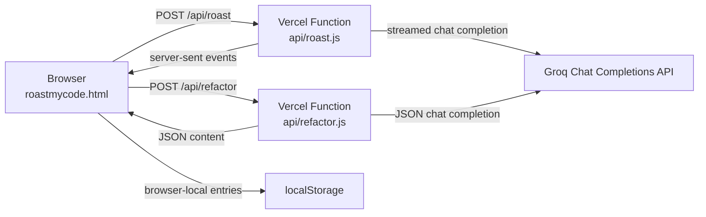

<div align="center">


# ROASTMYCODE

**An AI-powered code roaster and refactoring tool for developers who value memorable feedback.**

[](https://github.com/vincenzo-afk/roastmycode/actions/workflows/validate.yml)
[](https://github.com/vincenzo-afk/roastmycode/stargazers)
[](https://vercel.com/)
[](https://github.com/vincenzo-afk/roastmycode)
[](https://github.com/vincenzo-afk/roastmycode)

[Live application](https://roastmycode-lemon.vercel.app/) · [Documentation](#documentation) · [Report a bug](https://github.com/vincenzo-afk/roastmycode/issues/new?template=bug_report.yml) · [Request a feature](https://github.com/vincenzo-afk/roastmycode/issues/new?template=feature_request.yml)

</div>

---

## <a id="table-of-contents"></a>Table of Contents

- [About](#about)
- [Architecture](#architecture)
- [Tech Stack](#tech-stack)
- [Getting Started](#getting-started)
- [Usage](#usage)
- [API Reference](#api-reference)
- [Project Structure](#project-structure)
- [Features and Limitations](#features-and-limitations)
- [Testing and Continuous Integration](#testing-and-continuous-integration)
- [Deployment](#deployment)
- [Contributing](#contributing)
- [Security](#security)
- [License](#license)
- [Acknowledgments](#acknowledgments)

---

## <a id="about"></a>About

ROASTMYCODE is a browser-based developer tool that turns a submitted code sample into a structured AI code roast. It is designed to make technical feedback specific and engaging: the result includes a personality-driven roast, code-quality metrics, a code-alignment label, a worst-crime diagnosis, a suggested commit message, and a final verdict. It also provides a separate emergency-refactor flow that returns cleaned-up code with a damage assessment.

The project does not replace static analysis, testing, security scanning, or human review. It adds an explanatory and shareable feedback layer to a code-review moment, using a server-side Groq proxy so the provider credential remains outside browser code.

### What is implemented

- Eight roast modes: **Funny**, **Strict Professor**, **Hacker**, **Anime Villain**, **Gordon Ramsay**, **Passive Aggressive**, **Shakespeare**, and **Tamil Villain**.
- Streaming roast delivery with ten pain-score fields and an expected structured result contract.
- Emergency refactoring that returns a roast, revised code, damage assessment, and list of fixes.
- JavaScript, TypeScript, Python, Ruby, Rust, Java, C, C++, Go, and automatic language selection.
- Browser-local Hall of Shame entries, optional text-to-speech, shareable roast-card rendering, and dark/light themes.
- Search and social metadata, a crawler policy, sitemap, PWA manifest, repository calls to action, and the supplied ROASTMYCODE emblem.

The live application is available at [roastmycode-lemon.vercel.app](https://roastmycode-lemon.vercel.app/).

---

## <a id="architecture"></a>Architecture



The frontend is one static HTML document. It calls two Vercel functions, which read `GROQ_API_KEY` from the server environment and proxy requests to Groq using `llama-3.3-70b-versatile`. The client stores Hall of Shame entries in browser `localStorage`; no project database is configured.

---

## <a id="tech-stack"></a>Tech Stack

| Area | Technology | Repository evidence |
| --- | --- | --- |
| Frontend | HTML, CSS, and vanilla JavaScript | `roastmycode.html` |
| UI utility CSS | Tailwind CSS CDN | `https://cdn.tailwindcss.com` in the application head |
| Syntax highlighting | Prism.js 1.29.0 | CDN references in the application head |
| Image export | html2canvas 1.4.1 | CDN reference in the application head |
| Icons | Lucide ESM CDN import | `lucide@latest` import in the application head |
| Voice | Browser `SpeechSynthesis` API | Client-side read-aloud controls |
| Backend | Vercel Serverless Functions | `api/roast.js` and `api/refactor.js` |
| AI provider | Groq Chat Completions API | Both serverless functions |
| AI model | `llama-3.3-70b-versatile` | `GROQ_MODEL` constant in both functions |
| Storage | Browser `localStorage` | Hall of Shame implementation |
| Automation | GitHub Actions with Node.js 20 | `.github/workflows/validate.yml` |

---

## <a id="getting-started"></a>Getting Started

### Prerequisites

The static interface needs a modern JavaScript-enabled browser and a local static server. The live AI endpoints need a Vercel-compatible serverless runtime and a Groq API key stored as a server environment variable.

| Requirement | Why it is needed |
| --- | --- |
| Git | Clone the repository |
| Node.js 20 or later | Run the repository validation script and GitHub Actions job |
| Python 3 or another static server | Preview the static interface locally |
| Vercel account and CLI | Run or deploy the serverless functions locally and in production |
| Groq API key | Enable `/api/roast` and `/api/refactor` |

### Installation

```bash
git clone https://github.com/vincenzo-afk/roastmycode.git
cd roastmycode
node scripts/validate.mjs
```

Preview only the static interface:

```bash
python3 -m http.server 8080
```

Then open [http://localhost:8080/roastmycode.html](http://localhost:8080/roastmycode.html). A plain static server does not execute the `/api` functions.

### Configuration

Copy the provided environment template locally if required by your Vercel workflow:

```bash
cp .env.example .env
```

| Variable | Required for | Description |
| --- | --- | --- |
| `GROQ_API_KEY` | AI roasting and refactoring | Groq credential read only by the serverless functions. Keep it out of browser code and commits. |

For local function development, install the Vercel CLI and use:

```bash
npm install --global vercel
vercel dev
```

---

## <a id="usage"></a>Usage

### Roast code

1. Open the application and choose a roast mode.
2. Select a language or leave detection on automatic.
3. Paste a safe code sample into the editor, or load the built-in surprise sample.
4. Select **INITIATE ROAST** to receive the streaming structured verdict.
5. Review the roast, quality metrics, verdict, and optional Hall of Shame controls.

### Refactor code

Enter a code sample and select **REFACTOR**. The application sends the sample to the refactor endpoint, then presents a brief roast, the refactored code, a before/after damage assessment, and enumerated fixes.

### Share a result

Use the result controls after a roast completes. The application renders its roast-card template in the browser through html2canvas; it does not upload the card to project storage.

### Documentation

This README is the primary project documentation. Deployment details are below, while contribution and security expectations are in [CONTRIBUTING.md](CONTRIBUTING.md) and [SECURITY.md](SECURITY.md).

---

## <a id="api-reference"></a>API Reference

Both endpoints accept `POST` only. The Vercel functions use `GROQ_API_KEY` from the server environment to authenticate with Groq; clients do not send a provider key.

| Method | Path | Purpose | Successful response |
| --- | --- | --- | --- |
| `POST` | `/api/roast` | Generate a structured roast using the selected persona | Proxied `text/event-stream` response |
| `POST` | `/api/refactor` | Generate a clean refactor with assessment | JSON object containing `content` |

### `POST /api/roast`

```json
{
  "code": "function add(a, b) { return a + b; }",
  "mode": "funny",
  "language": "javascript"
}
```

`code` is required. `mode` selects a built-in system prompt and falls back to `funny` when not recognized. `language` is optional and defaults to `auto`. The endpoint forwards the Groq streaming response as server-sent events (`text/event-stream`).

The requested final payload includes `roast`, a `pain_score` object, `developer_personality`, `code_alignment`, `excuse`, `lore`, `worst_crime`, `git_commit_suggestion`, `humanity_status`, `can_reach_production`, and `verdict`.

### `POST /api/refactor`

```json
{
  "code": "const items = data.map(x => x.value)",
  "language": "javascript"
}
```

Successful responses have this shape:

```json
{
  "content": "ROAST: ...\n\nREFACTORED:\n```javascript\n..."
}
```

### Errors

| Status | Condition |
| --- | --- |
| `400` | The request body did not include `code`. |
| `405` | The request used a method other than `POST`. |
| Provider status | Groq rejected or limited the upstream request. |
| `500` | `GROQ_API_KEY` is absent or an internal proxy failure occurred. |

---

## <a id="project-structure"></a>Project Structure

```text
roastmycode/
├── .github/
│   ├── ISSUE_TEMPLATE/        # Bug and feature request forms
│   ├── workflows/validate.yml # Dependency-free validation workflow
│   ├── CODEOWNERS             # Verified repository owner
│   └── PULL_REQUEST_TEMPLATE.md
├── api/
│   ├── refactor.js            # Non-streaming Groq refactor proxy
│   └── roast.js               # Streaming Groq roast proxy
├── assets/
│   └── roastmycode-logo.png   # Product emblem
├── scripts/
│   └── validate.mjs           # Source/configuration validation
├── .env.example               # GROQ_API_KEY template
├── CONTRIBUTING.md            # Contribution workflow
├── README.md                  # Project documentation
├── SECURITY.md                # Vulnerability reporting policy
├── roastmycode.html           # Complete browser application
├── robots.txt                 # Crawler policy
├── site.webmanifest           # Installable app metadata
├── sitemap.xml                # Homepage sitemap
└── vercel.json                # Vercel routing and function duration
```

---

## <a id="features-and-limitations"></a>Features and Limitations

### Current features

- ✅ AI roast and emergency refactor flows through Groq.
- ✅ Streamed roast output, structured result fields, and pain-score metrics.
- ✅ Multiple roast personas and language choices.
- ✅ Shareable image cards, browser speech, themes, and a local Hall of Shame.
- ✅ SEO metadata, sitemap, robots policy, app manifest, and repository links.
- ✅ GitHub Actions validation for tracked configuration and common credential patterns.

### Known limitations

- There is no package manifest, dependency lockfile, automated browser test suite, or coverage report.
- The Hall of Shame is local to a browser and is not a shared or authenticated leaderboard.
- AI response availability depends on Groq service behavior, valid server configuration, and Vercel function execution.
- The external CDN resources are not currently integrity-pinned.
- No project license file is present, so reuse rights are not specified.

The repository has no published releases or changelog at this time. Commit history is available on the [main branch](https://github.com/vincenzo-afk/roastmycode/commits/main).

---

## <a id="testing-and-continuous-integration"></a>Testing and Continuous Integration

Run the project validator before opening a pull request:

```bash
node scripts/validate.mjs
```

The validation checks tracked files, Vercel routing, manifest JSON, crawl metadata, expected server-side credential use, and common token patterns. GitHub Actions runs this same command on pushes and pull requests targeting `main`.

Manual testing remains necessary for the interactive editor, browser sharing, speech synthesis, server-sent event handling, and successful Groq responses. There is no configured automated browser test or code-coverage workflow.

---

## <a id="deployment"></a>Deployment

The repository is configured for Vercel. Import the GitHub repository into Vercel, set `GROQ_API_KEY` in the project environment settings, and deploy. The provided [`vercel.json`](vercel.json) rewrites `/` to `roastmycode.html` and configures a 10-second maximum duration for files matching `api/*.js`.

Static hosts can serve the HTML, logo, manifest, robots policy, and sitemap. They cannot execute the existing `/api/roast` or `/api/refactor` Vercel functions without an equivalent serverless implementation.

---

## <a id="contributing"></a>Contributing

Read [CONTRIBUTING.md](CONTRIBUTING.md) before opening an issue or pull request. In short, use a focused branch, keep commits concise and imperative, run `node scripts/validate.mjs`, test the affected behavior manually, and avoid committing keys or private code samples.

The repository now provides structured [bug](https://github.com/vincenzo-afk/roastmycode/issues/new?template=bug_report.yml) and [feature-request](https://github.com/vincenzo-afk/roastmycode/issues/new?template=feature_request.yml) forms, plus a pull-request checklist.

---

## <a id="security"></a>Security

Read [SECURITY.md](SECURITY.md) for the supported branch and private reporting route. Do not submit credentials or sensitive source code in public issues. The serverless functions intentionally read `GROQ_API_KEY` only from the deployment environment.

---

## <a id="license"></a>License

No `LICENSE` file is currently included. The repository does not specify reuse, redistribution, or modification permissions. Contact the repository owner before relying on permissions that are not granted in a future license file.

---

## <a id="acknowledgments"></a>Acknowledgments

ROASTMYCODE uses [Groq](https://groq.com/) for chat completions, [Vercel](https://vercel.com/) for serverless deployment, [Prism](https://prismjs.com/) for code highlighting, [html2canvas](https://html2canvas.hertzen.com/) for client-side card rendering, [Lucide](https://lucide.dev/) for icons, and the supplied ROASTMYCODE emblem for the project identity.

---

<div align="center">

[Back to top](#roastmycode) · [GitHub repository](https://github.com/vincenzo-afk/roastmycode) · [Live application](https://roastmycode-lemon.vercel.app/) · [Security policy](SECURITY.md)

Built by [vincenzo-afk](https://github.com/vincenzo-afk).

</div>
